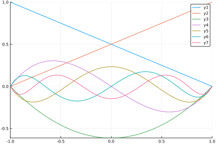

# Basis functions

```@setup FEMBase
using FEMBase
using FEMBase.FEMBasis: eval_dbasis!, jacobian, grad, interpolate,
                        get_reference_element_coordinates, create_basis
using FEMBasis
```

Shape functions, also known as basis functions, interpolation polynomials and
so on. Typically unknown field variable is interpolated from element nodal
values using continuous functions. That is, 

```math
u(\xi,t) = \sum_{i} N(\xi,t) u_{i}[t]
```math

Standard Lagrange shape functions are implemented.

Linear shape functions:
- Seg2 (2-node segment)
- Tri3 (3-node triangle)
- Quad4 (4-node quadrangle)
- Tet4 (4-node tetrahedron)
- Pyr5 (5-node pyramid)
- Wedge6 (6-node wedge)
- Hex8 (8-node hexahedra)

Quadratic and biquadratic shape functions:
- Seg3
- Tri6, Tri7
- Quad8, Quad9
- Tet10
- Wedge15
- Hex20, Hex27

NURBS shape functions:
- NSeg
- NSurf
- NSolid

Creating new basis is done simply by calling that constructor, without any
arguments:

```@repl FEMBase
Seg2()
Tri3()
Quad4()
```

The dimensions of basis functions can be determined by `size` and `length`.
In JuliaFEM, we have a convention that arrays grow on right according to
number of nodes and down according to the spatial index. So if we have a
row vector $\boldsymbol N$ and a column vector $\boldsymbol u$, interpolation
goes $u = \boldsymbol N \boldsymbol u$:

```@repl FEMBase
N = [1 2 3] # evaluated basis functions
u = [1, 2, 3] # field value at discrete points
N*u
```

For example, `Quad4` is defined in two dimensions and it has 4 nodes, so
```@repl FEMBase
B = Quad4()
size(B)
length(B)
```

Evaluating basis functions and they partial derivatives with respect to some
$\xi$ is done efficiently using `eval_basis!` and `eval_dbasis!`. For these
commands one needs to allocate array outside of the hot loops to get speed.

```@repl FEMBase
N = zeros(1, length(B))
dN = zeros(size(B)...)
xi = (0.0, 0.0)
eval_basis!(B, N, xi)
eval_dbasis!(B, dN, xi)
```

For Langrange interpolation polynomials, by definition, on each node shape
function corresponding to that node gets value of 1 and the rest is zero.
Node ordering follows the same defined in e.g. in ABAQUS and in many other
FEM softwares. The actual shape of domain can be inspected using command
`get_reference_element_coordinates`:

```@repl FEMBase
get_reference_element_coordinates(Quad4)
```

```@example FEMBase
for xi in get_reference_element_coordinates(Quad4)
    eval_basis!(B, N, xi)
    println("$N at $xi")
end
```

## Mathematics

Without knowing anything about the shape of the real domain (after all, basis
is usually defined on dimensionless, reference domain), `eval_dbasis!` is
calculating gradient with respect to dimensionless coordinates $\xi_i$, i.e.

```math
\left(\frac{\partial\boldsymbol{N}}{\partial\boldsymbol{\xi}}\right)_{ij}=\frac{\partial N_{j}}{\partial\xi_{i}}
```

Usually this is not wanted, but instead gradient of basis functions is
calculated with respect to natural coordinates $X_i$,

```math
\left(\frac{\partial\boldsymbol{N}}{\partial\boldsymbol{X}}\right)_{ij}=\frac{\partial N_{j}}{\partial X_{i}}
```

Without going into the mathematical details, to transform partial derivatives
from reference element to natural coordinates, inverse of Jacobian matrix is
needed.

```@repl FEMBase
X = ([0.0, 0.0], [1.0, 0.0], [1.0, 1.0], [0.0, 1.0])
xi = (0.0, 0.0)
J = jacobian(B, X, xi)
inv(J) * dN
```

Or directly, using `grad`:


```@repl FEMBase
dNdX = grad(B, X, xi)
```

If interpolation domain is a manifold, i.e. space having lower dimension than
the actual space (read: surface in 3d), Jacobian is not square and inverse
cannot be taken.

```@repl FEMBase
X2 = ([0.0,0.0,0.0], [1.0, 0.0,1.0], [1.0,1.0,1.0], [0.0,1.0,0.0])
xi = (0.0, 0.0)
J = jacobian(B, X2, xi)
```

One can use Jacobian to calculate
[surface integral](https://en.wikipedia.org/wiki/Surface_integral):

```math
\iint_{S}f\,\mathrm{d}\Sigma=\iint_{T}f\left(\boldsymbol{x}\left(s,t\right)\right)\left\Vert \frac{\partial\boldsymbol{x}}{\partial s}\times\frac{\partial\boldsymbol{x}}{\partial t}\right\Vert \,\mathrm{d}s\mathrm{d}t
```

```@repl FEMBase
4*norm(cross(J[1,:], J[2,:])), sqrt(2) # area of manifold
```

Gradient of e.g. displacement field or temperature field can be also evaluated,
with the same `grad` function, by adding field `u`:

```@repl FEMBase
u = ([0.0, 0.0], [1.0, -1.0], [2.0, 3.0], [0.0, 0.0])
T = (1.0, 2.0, 3.0, 4.0)
grad(B, u, X, xi)
grad(B, T, X, xi)
```

One can interpolate fields using basis, i.e. calculate $u = \boldsymbol{N}\boldsymbol{u}$ as described before:

```@repl FEMBase
interpolate(B, u, xi)
interpolate(B, T, xi)
```

In "hot loops", it's absolutely necessary that no unnecessary memory allcations
happen as it is reducing the performance dramatically from C speed. To avoid
unnecessary memory allocations, a struct `BasisInfo` is introduced, containing
workspace for calculations.

```@repl FEMBase
bi = BasisInfo(Quad4)
eval_basis!(bi, X, xi)
bi.J       # Jacobian
bi.N       # shape functions
bi.dN      # shape function derivatives, with respect to xi
bi.detJ    # determinant of Jacobian
bi.grad    # shape function derivatives, with respect to X
bi.invJ    # inverse of Jacobian
```

Calculating gradient of some field `u` can be done memory efficiently using
this `BasisInfo` structure:

```@repl FEMBase
gradu = zeros(2, 2)
grad!(bi, gradu, u)
```

## Defining custom shape functions

Depending from the type of shape functions, they can be created more or less
automatic way. An ultimate goal is to create all kind of shape functions just
by defining the general principles and let computer handle the all boring
things and create shape functions automatically using metaprogramming to get
efficient code.

For Lagrange type interpolation, ones needs only to define polynomial and
corner points for domain. For example, if domain is $[0,1]^2$, one can use
`create_basis`, and give polynomial with degree matching to the number of
point to interpolate.


```@repl FEMBase
code = create_basis(
    :MyQuad,
    "My special domain",
    (
        (0.0, 0.0),
        (1.0, 0.0),
        (1.0, 1.0),
        (0.0, 1.0),
    ),
    "1 + u + v + u*v"
);

eval(code)
```

What we have defined is a interpolation polynomial and "corner points". As
a result, we have a new basis `MyQuad`, working just like expected. All
Lagrange polynomials are done like this.

```@repl FEMBase
B = MyQuad()
xi = (0.5, 0.5)
eval_basis!(B, N, xi)
```

In this case, and considering domain, partial derivatives of shape functions
are with respect to $X$, because interpolation polynomials are calculated
against real domain and not "reference domain". That is, partial derivatives
should match to what already calcualated.


```@repl FEMBase
eval_dbasis!(B, dN, xi)
```

Jacobian should be identity matrix:

```@repl FEMBase
J = jacobian(B, X, xi)
```

And taking gradient with respect to $X$ should return also same result than
before:
```@repl FEMBase
u = ([0.0, 0.0], [1.0, -1.0], [2.0, 3.0], [0.0, 0.0])
grad(B, u, X, xi)
```

Shape functions can be defined manually and calculate partial derivatives
automatically. For example, for pyramid elements typical ansatz approach is
not applicable. Some other degenerated elements exists in fracture mechanics.

For example, C1-continuous Hermite shape functions ready to approximate
Euler-Bernoulli beam equations can be defined as:


```@repl FEMBase
code = create_basis(
    :C1Hermite,
    "C1-continuous Hermite shape functions",
    (
        (0.0,),
        (0.0,),
        (1.0,),
        (1.0,)
    ),
    (
        "2*u^3 - 3*u^2 + 1",
        "u^3 - 2*u^2 + u",
        "-2*u^3 + 3*u^2",
        "u^3 - u^2"
    )
);
eval(code)
```

Again, we should have 1.0 in corresponding nodal point or it's derivative,
according to that order we have $u(0), u'(0), u(1), u'(1)$, so

```@repl FEMBase
B = C1Hermite()
N = zeros(1, 4)
dN = zeros(1, 4)
eval_basis!(B, N, (0.0,))
eval_dbasis!(B, dN, (0.0,))
eval_basis!(B, N, (1.0,))
eval_dbasis!(B, dN, (1.0,))
```

The last option is to build everything from scratch. For that, one must
import and define following functions:
- Base.size
- Base.length
- FEMBase.get_reference_element_coordinates
- FEMBase.eval_basis!
- FEMBase.eval_dbasis!

As an examples, a simple implementation of P-hierarchical 1d-basis would
then be the following:

```@example FEMBase
import Base: size, length
import FEMBase: get_reference_element_coordinates,
                eval_basis!, eval_dbasis!,
                AbstractBasis

type PSeg <: AbstractBasis
    order :: Int
end

function PSeg()
    return PSeg(1)
end

function length(basis::PSeg)
    return basis.order+1
end

function size(basis::PSeg)
    return (1, basis.order+1)
end

function get_reference_element_coordinates(basis::PSeg)
    return ((-1.0,), (1.0,))
end

nothing # hide
```

Next, define Legengre polynomials:

```@example FEMBase
"""
    get_legendre_polynomial(n)

Return Legendgre polynomial of order `n` to inverval ξ ∈ [1, 1].

Implementation uses Bonnet's recursion formula. See
https://en.wikipedia.org/wiki/Legendre_polynomials
"""
function get_legendre_polynomial(n)
    n == 0 && return xi -> 1.0
    n == 1 && return xi -> xi
    Pm1 = get_legendre_polynomial(n-1)
    Pm2 = get_legendre_polynomial(n-2)
    A(xi) = (2.0*n-1.0)*xi*Pm1(xi)
    B(xi) = (n-1.0)*Pm2(xi)
    return xi -> (A(xi)-B(xi))/n
end

"""
    get_legendre_polynomial_derivative(n)

Return derivative of Legendgre polynomial of order `n` to
inverval ξ ∈  [-1, 1]
"""
function get_legendre_polynomial_derivative(n)
    n == 0 && return xi -> 0.0
    n == 1 && return xi -> 1.0
    Pm1 = get_legendre_polynomial_derivative(n-1)
    Pm2 = get_legendre_polynomial_derivative(n-2)
    A(xi) = (2.0*(n-1.0)+1.0)*xi*Pm1(xi)
    B(xi) = (n+1.0-1.0)*Pm2(xi)
    return xi -> (A(xi)-B(xi))/(n-1.0)
end

nothing # hide
```

And finally implement `eval_basis!` and `eval_dbasis!` functions:

```@example FEMBase
function eval_basis!{T}(basis::PSeg, N::Matrix{T}, xi::Tuple{T})
    n = length(basis)
    t = xi[1]
    N[1] = 0.5*(1-t)
    N[2] = 0.5*(1+t)
    n < 3 && return N
    for i=3:n
        j = i-1
        P1 = get_legendre_polynomial(j)
        P2 = get_legendre_polynomial(j-2)
        N[i] = 1.0/sqrt(2.0*(2.0*j-1.0))*(P1(t)-P2(t))
    end
    return N
end

function eval_dbasis!{T}(basis::PSeg, dN::Matrix{T}, xi::Tuple{T})
    n = length(basis)
    t = xi[1]
    dN[1] = -0.5
    dN[2] = 0.5
    n < 3 && return N
    for i=3:n
        j = i-1
        P1 = get_legendre_polynomial_derivative(j)
        P2 = get_legendre_polynomial_derivative(j-2)
        dN[i] = 1.0/sqrt(2.0*(2.0*j-1.0))*(P1(t)-P2(t))
    end
    return dN
end

nothing # hide
```

Let's try it:

```@repl FEMBase 
B = PSeg()
N = zeros(1, length(B))
eval_basis!(B, N, (0.0,))
B.order = 2
N = zeros(1, length(B))
eval_basis!(B, N, (0.0,))
```



